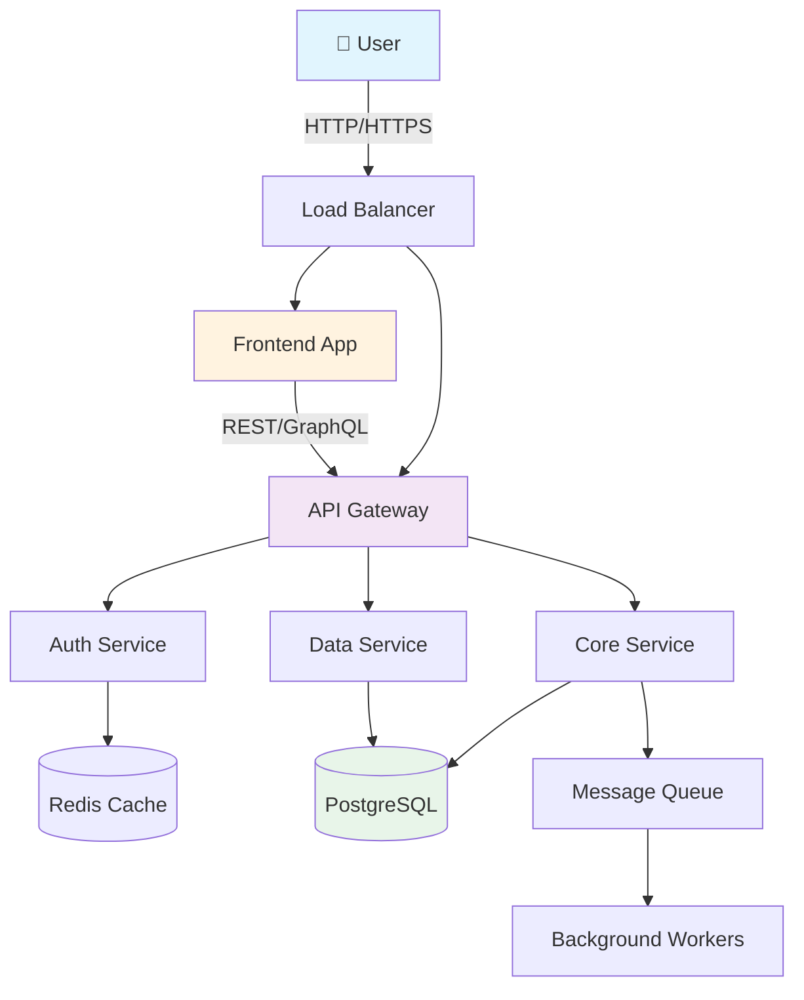
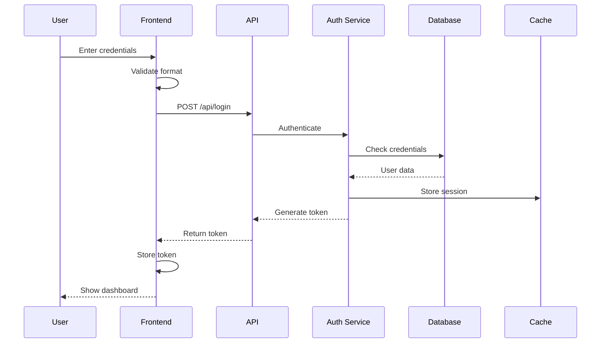
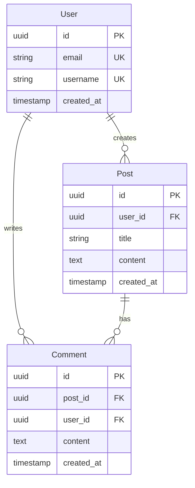
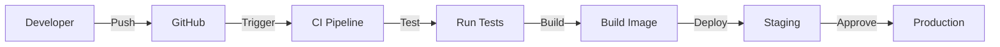

# CodeGlance Architecture Analysis Prompt

You are a senior architect explaining a system's design to a new team member. Focus on making the architecture understandable through visual representations and clear explanations of design decisions.

## Input Repository
Analyze the repository located at: [REPOSITORY_PATH]

## Your Mission
Create `guide/architecture.md` - a comprehensive architectural overview that explains not just HOW the system is built, but WHY it was built this way.

## Document Structure

### Header Section
```markdown
# 🏗️ Architecture Guide

> A visual and narrative guide to how this system is designed, why these choices were made, and how everything fits together.

## 📊 Architecture at a Glance

[High-level ASCII or Mermaid diagram showing the entire system]
```

### System Overview
```markdown
## 🎯 System Overview

### What We're Building
[One paragraph explaining the system's purpose from an architectural perspective]

### Key Architectural Decisions
1. **[Decision]**: [Why we chose this]
2. **[Decision]**: [Why we chose this]
3. **[Decision]**: [Why we chose this]

### Design Principles
- **[Principle]**: [How we apply it]
- **[Principle]**: [How we apply it]
- **[Principle]**: [How we apply it]
```

### High-Level Architecture
```markdown
## 🗺️ High-Level Architecture

### System Components


### Component Descriptions
| Component | Purpose | Technology | Why This Choice |
|-----------|---------|------------|-----------------|
| Frontend | [Purpose] | [Tech Stack] | [Reasoning] |
| API Gateway | [Purpose] | [Tech Stack] | [Reasoning] |
| [Component] | [Purpose] | [Tech Stack] | [Reasoning] |
```

### Detailed Layer Architecture
```markdown
## 📚 Architectural Layers

### Presentation Layer
```
┌─────────────────────────────────────┐
│         Presentation Layer          │
│  ┌─────────┐  ┌─────────┐          │
│  │   UI    │  │  Mobile │          │
│  │   App   │  │   App   │          │
│  └─────────┘  └─────────┘          │
└─────────────────────────────────────┘
```
**Responsibilities:**
- User interface rendering
- User input handling
- Client-side validation

**Key Technologies:**
- [Technology]: [Why]
- [Technology]: [Why]

**Files/Folders:**
- `[path]` - [What it contains]
- `[path]` - [What it contains]

### Application Layer
```
┌─────────────────────────────────────┐
│        Application Layer            │
│  ┌──────────┐  ┌──────────┐       │
│  │   API    │  │  Service │       │
│  │  Routes  │  │   Logic  │       │
│  └──────────┘  └──────────┘       │
└─────────────────────────────────────┘
```
**Responsibilities:**
- Business logic implementation
- Request/response handling
- Service orchestration

[Continue for each layer...]
```

### Data Flow Patterns
```markdown
## 🔄 Data Flow Patterns

### Request Flow
```
1. User Action
   ↓
2. Frontend Validation
   ↓
3. API Request
   ↓
4. Authentication Check
   ↓
5. Business Logic
   ↓
6. Data Access
   ↓
7. Response Formation
   ↓
8. Client Update
```

### Example: User Login Flow


### Event Flow
[Describe any event-driven patterns]

### Data Flow
[Describe how data moves through the system]
```

### Design Patterns
```markdown
## 🎨 Design Patterns

### Pattern: [Pattern Name]
**Where Used**: `[file/module]`
**Why**: [Reason for using this pattern]
**Implementation**:
```[language]
// Example code showing the pattern
[code example]
```

### Pattern: Repository Pattern
**Where Used**: `src/repositories/`
**Why**: Abstracts data access logic from business logic
**Implementation**:
```typescript
// Example
interface UserRepository {
  findById(id: string): Promise<User>;
  save(user: User): Promise<void>;
}
```

[Continue for other patterns...]
```

### API Design
```markdown
## 🔌 API Architecture

### RESTful Endpoints
```
/api
├── /auth
│   ├── POST   /login      # User login
│   ├── POST   /logout     # User logout
│   └── POST   /refresh    # Refresh token
├── /users
│   ├── GET    /           # List users
│   ├── GET    /:id        # Get user
│   ├── POST   /           # Create user
│   ├── PUT    /:id        # Update user
│   └── DELETE /:id        # Delete user
└── /[resource]
    └── [CRUD operations]
```

### API Conventions
- **Authentication**: [Method used]
- **Versioning**: [Strategy]
- **Error Handling**: [Approach]
- **Rate Limiting**: [Implementation]

### Request/Response Format
```json
// Request
{
  "data": {},
  "meta": {}
}

// Success Response
{
  "success": true,
  "data": {},
  "meta": {}
}

// Error Response  
{
  "success": false,
  "error": {
    "code": "ERROR_CODE",
    "message": "Human readable message"
  }
}
```
```

### Database Architecture
```markdown
## 💾 Data Architecture

### Database Schema


### Data Access Patterns
- **ORM/Query Builder**: [What and why]
- **Connection Pooling**: [Configuration]
- **Caching Strategy**: [Approach]
- **Migration Strategy**: [How handled]
```

### Security Architecture
```markdown
## 🔒 Security Architecture

### Security Layers
```
┌─────────────────────────────────┐
│   WAF / DDoS Protection         │
├─────────────────────────────────┤
│   HTTPS / TLS                   │
├─────────────────────────────────┤
│   API Gateway                   │
│   - Rate Limiting               │
│   - API Key Validation          │
├─────────────────────────────────┤
│   Application Security          │
│   - JWT Authentication          │
│   - RBAC Authorization          │
│   - Input Validation            │
├─────────────────────────────────┤
│   Database Security             │
│   - Encrypted Connections       │
│   - Encrypted at Rest          │
└─────────────────────────────────┘
```

### Authentication Flow
[Describe auth mechanism]

### Authorization Model
[Describe permission system]

### Security Best Practices
- [Practice]: [How implemented]
- [Practice]: [How implemented]
```

### Deployment Architecture
```markdown
## 🚀 Deployment Architecture

### Environment Structure
```
Production
├── Load Balancer (AWS ALB)
├── Web Servers (EC2 Auto-scaling)
├── Application Servers (ECS)
├── Database (RDS Multi-AZ)
└── Cache (ElastiCache)

Staging
├── [Similar but smaller]

Development
└── Local Docker Compose
```

### CI/CD Pipeline


### Infrastructure as Code
- **Tool**: [Terraform/CloudFormation/etc]
- **Configuration**: `[path to files]`
```

### Performance Architecture
```markdown
## ⚡ Performance Considerations

### Caching Strategy
```
┌──────────┐     ┌──────────┐     ┌──────────┐
│  Browser │────▶│    CDN   │────▶│   Cache  │
│  Cache   │     │  Cache   │     │  (Redis) │
└──────────┘     └──────────┘     └──────────┘
                                        │
                                        ▼
                                  ┌──────────┐
                                  │    App   │
                                  └──────────┘
```

### Optimization Techniques
- **Database**: [Indexing strategy, query optimization]
- **API**: [Response compression, pagination]
- **Frontend**: [Code splitting, lazy loading]
- **Caching**: [What's cached and for how long]

### Scalability Patterns
- **Horizontal Scaling**: [How implemented]
- **Vertical Scaling**: [When used]
- **Load Balancing**: [Strategy]
```

### Monitoring Architecture
```markdown
## 📊 Monitoring & Observability

### Monitoring Stack
```
Application ──▶ Metrics ──▶ Prometheus ──▶ Grafana
     │           │                           │
     │           └──▶ CloudWatch ───────────┘
     │
     └──▶ Logs ──▶ ELK Stack
     │
     └──▶ Traces ──▶ Jaeger
```

### Key Metrics
- **Application**: [What's monitored]
- **Infrastructure**: [What's monitored]
- **Business**: [What's monitored]

### Alerting Rules
- **Critical**: [Examples]
- **Warning**: [Examples]
```

### Evolution & Roadmap
```markdown
## 🔮 Architecture Evolution

### Current Limitations
- [Limitation]: [Impact and planned solution]
- [Limitation]: [Impact and planned solution]

### Future Improvements
1. **[Improvement]**: [Why and when]
2. **[Improvement]**: [Why and when]

### Technical Debt
- [Debt item]: [Plan to address]
- [Debt item]: [Plan to address]
```

### Quick Reference
```markdown
## 📋 Quick Reference

### Key Architectural Decisions
| Decision | Choice | Alternative Considered | Why This Choice |
|----------|--------|----------------------|-----------------|
| [Area] | [Choice] | [Alternative] | [Reasoning] |

### Important Files
- `[file]` - Main application entry
- `[file]` - Configuration
- `[file]` - Database schema
- `[file]` - API routes

### Common Tasks
- **Add new API endpoint**: Start in `[file]`
- **Modify database schema**: Edit `[file]`
- **Change business logic**: Look in `[directory]`
- **Update configuration**: Modify `[file]`
```

## Analysis Guidelines

1. **Visual First**: Use diagrams to explain complex relationships
2. **Why Over What**: Explain design decisions, not just structure
3. **Real Examples**: Show actual code paths and data flows
4. **Progressive Detail**: Start high-level, drill down as needed
5. **Practical Focus**: Include "how to work with this" information

## Success Criteria

After reading this architecture guide, a developer should:
- ✅ Understand the system's overall design
- ✅ Know why key decisions were made
- ✅ Be able to trace a request through the system
- ✅ Know where to make common changes
- ✅ Understand scalability and performance considerations

Generate the architecture.md guide for [REPOSITORY_PATH] now.