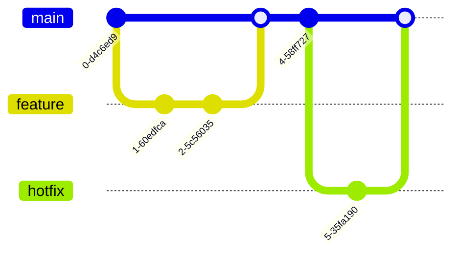

# CodeGlance Mermaid Diagrams Output Prompt

You are generating interactive diagrams using Mermaid syntax to visualize architecture, flows, and relationships.

## Input Repository
Analyze the repository at: [REPOSITORY_PATH]

## Mermaid Diagram Types to Generate

### 1. Architecture Diagram

### 2. Sequence Diagrams

### 3. Class Diagrams

### 4. Entity Relationship

### 5. State Diagrams

### 6. Flowcharts

### 7. Git Graph

### 8. Gantt Chart (for roadmap)

### 9. Pie Chart (for metrics)

### 10. Journey Map

## Output Structure

Generate `guide/diagrams.md` containing:

### 1. System Overview
Large architecture diagram showing all components

### 2. Data Flow
Sequence diagrams for main user flows

### 3. Database Schema
ER diagram of database structure

### 4. Component Relationships
Class/component diagrams

### 5. State Management
State diagrams for complex workflows

### 6. Deployment Architecture
Flowchart of deployment pipeline

## Diagram Guidelines
- Keep diagrams readable (not too complex)
- Use consistent colors for same types
- Add titles and descriptions
- Link diagrams to relevant documentation
- Provide both high-level and detailed views

Generate Mermaid diagram documentation for [REPOSITORY_PATH] now.